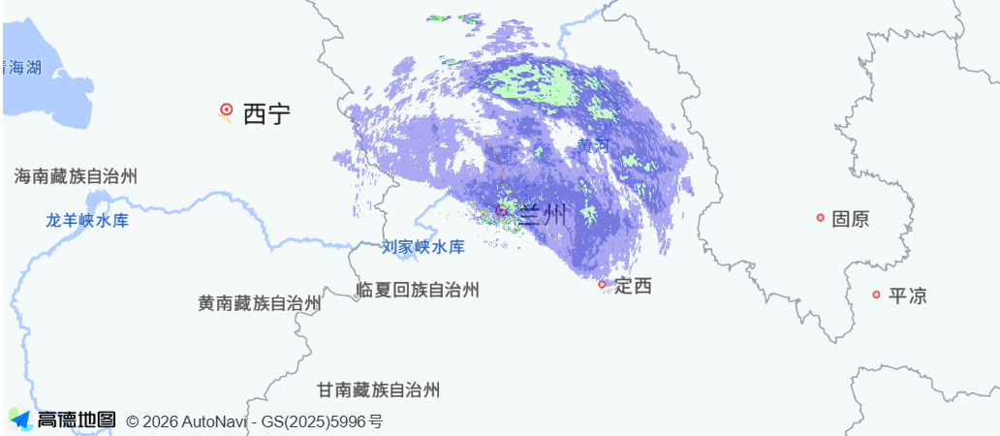

# 雷达 bin 文件解析绘图程序



* 目前只支持 `CR`, `PPI` 文件类型, 文档简陋, 后续完善

### 更新说明
- v1.0.0: 初始版本, 当前只支持 `CR` 文件类型
  - v1.0.1: 
    - 修改了`CRParse`中的 `drawCanvas`方法. 现在它额外接收一个参数用来控制格子大小和图片绘制范围
    - `CRParse` 中新增了一个 `drawGrayCanvas(drawParams: DrawParams)` 方法, 用来绘制灰度图, 这个方法不受色标的影响, 只根据数据值的大小来绘制灰度图, 适合用来调试数据和色标的关系
  - v1.0.2: 
    - 增加了产品类型是 `54`的解析器, 他也是 `CR` 文件类型
  - v1.0.3:
    - 增加了 `PPI` 文件类型的解析器
    - 增加了一个 `getGeoJson(level: (number | string)[]): FeatureCollection`方法, 用来获取数据的GeoJson格式, 返回值中的`properties.li`是`level`的下标, 方便配合色标

### 使用
1. 安装这个库
```shell
npm i radar-w-fast
```

2. 使用示例
```vue
<script lang="ts" setup>
import { ref } from 'vue'
import RadarReader from 'radar-w-fast'
import file from 'xxx.bin?url' // 这里是你的bin文件路径

const minRef = ref()
const maxRef = ref()
const init = async () => {
    const radar = new RadarReader(file)
    await radar.start() // start() 方法用来解析基本信息, 不包括产品数据
    
    // 如果需要自行注册其他解析器传入一个Map对象即可
    // const map = new Map()
    // map.set(18, YourParser) // 18是CR文件的类型
    // radar.registryParser(map)
    
    await radar.parse() // parse() 是根据注册的解析器和产品类型来解析的, 每个产品是不一样的解析器,也是不同的结果

    const legend = await radar.getDefaultLegend() // 获取默认的色标, 当然你也可以自己定义色标
    let color: string[] = []
    let level: number[] = []
    if (legend) {
        color = legend.colors
        level = legend.levels
    }

    const station = radar.stationInfo   // stationInfo 是站点基本信息, 需要使用其中的经纬度信息, (是所有数据的中心点)
    if (!station) return

    if (radar.radarBaseInfo?.productParams) {   // 这里是产品参数段, 在 `parse()`之后生成
        // - const canvas = radar.drawCanvas(radar.radarBaseInfo?.productParams, level, color)
        const canvas = radar.drawCanvas(radar.radarBaseInfo?.productParams, level, color, {
            size: 4, //格子大小
            min: minRef.value,
            max: maxRef.value
        })
        const bounds = radar.getBounds() // 获取数据的边界范围, 需要配合地图使用 (leaflet为基准), AMap中使用的是[lng,lat]的格式, leaflet中使用的是[lat,lng]的格式, 注意区分
        // 叠加到地图上
        // leaflet为例: 
        // L.imageOverlay(canvas.toDataURL(), bounds).addTo(map)
        
        // AMap为例: 
        // new AMap.ImageLayer({
        //   url: canvas.toDataURL('image/png'),
        //   bounds: [bounds[0][1], bounds[0][0], bounds[1][1], bounds[1][0]],
        // })
    }
}
</script>
```


#### @author: wangrl
#### 维护随缘